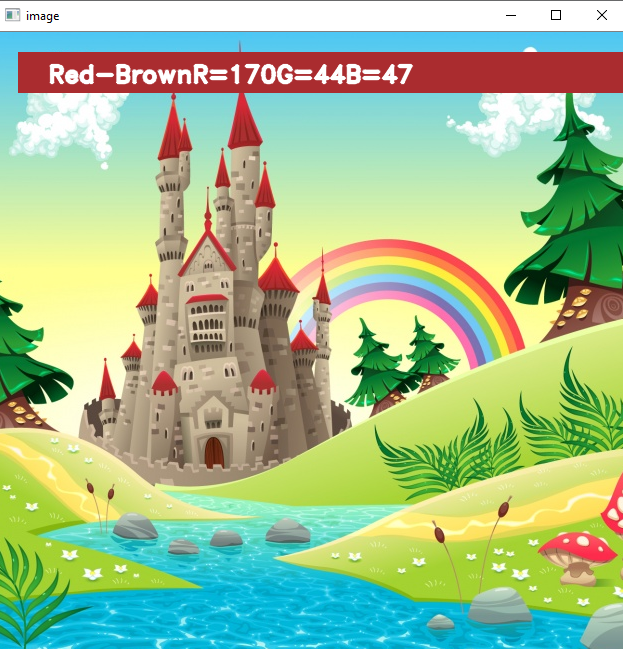
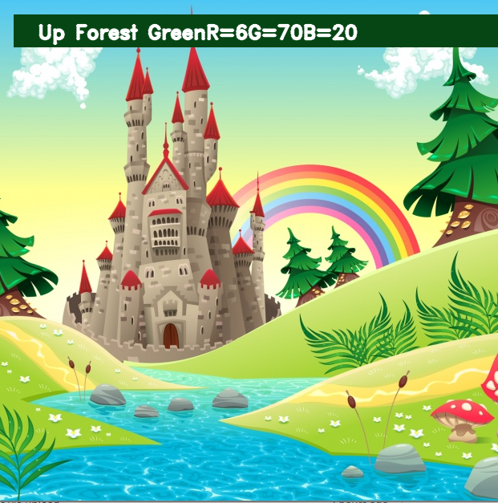

# color_detection

This model is coded in Python which is used to identify the color of the image and its RGB value by clicking on the image.

The project folder contains 3 files:

 Color_detection.py – main source code of our project. 
 Color.jpg – sample image for experimenting. 
 Colors.csv – a file that contains our dataset. 
 screenshot- a screenshot of a result. 

## SCREENSHOTS

